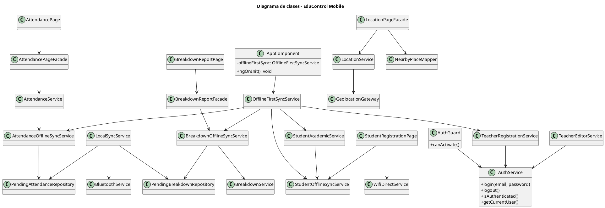
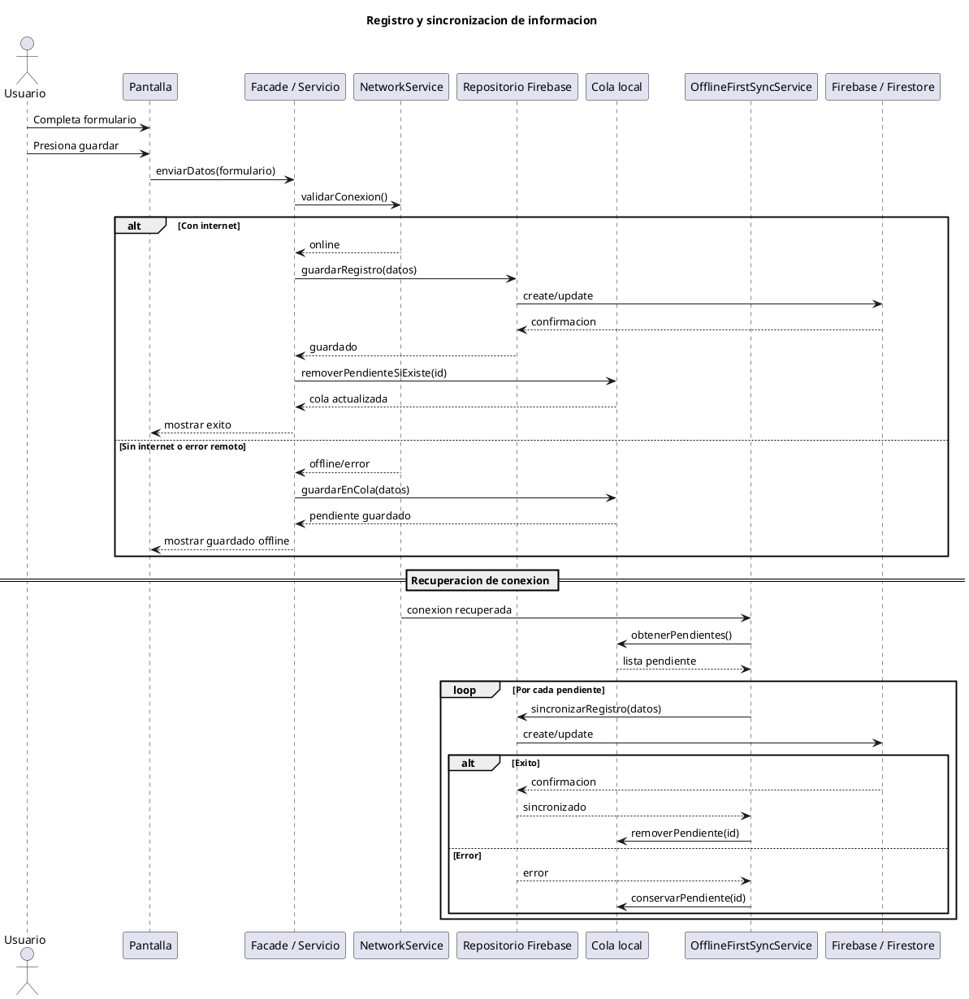

# EduControl Mobile

EduControl Mobile es una aplicacion movil/web desarrollada con Ionic, Angular y Capacitor para apoyar la gestion escolar en centros educativos. El proyecto centraliza procesos como asistencia diaria, registro de averias, gestion de docentes, registro de estudiantes, ubicacion del usuario, funcionamiento offline-first y sincronizacion local mediante capacidades nativas de Android.

Repositorio:

```text
https://github.com/JoanVasquez/educontrol_mobile_project
```

## Tabla de contenido

- [Descripcion general](#descripcion-general)
- [Objetivos del proyecto](#objetivos-del-proyecto)
- [Tecnologias principales](#tecnologias-principales)
- [Modulos funcionales](#modulos-funcionales)
- [Roles y seguridad](#roles-y-seguridad)
- [Arquitectura general](#arquitectura-general)
- [Estructura del proyecto](#estructura-del-proyecto)
- [Requisitos previos](#requisitos-previos)
- [Instalacion](#instalacion)
- [Configuracion de Firebase](#configuracion-de-firebase)
- [Ejecucion en navegador](#ejecucion-en-navegador)
- [Ejecucion en Android](#ejecucion-en-android)
- [Pruebas unitarias](#pruebas-unitarias)
- [Sincronizacion offline-first](#sincronizacion-offline-first)
- [Bluetooth local](#bluetooth-local)
- [WiFi Direct](#wifi-direct)
- [Geolocalizacion y lugares cercanos](#geolocalizacion-y-lugares-cercanos)
- [Scripts disponibles](#scripts-disponibles)
- [Bugs encontrados y estado](#bugs-encontrados-y-estado)
- [Diagramas PlantUML](#diagramas-plantuml)
- [Recomendaciones de desarrollo](#recomendaciones-de-desarrollo)

## Descripcion general

EduControl Mobile permite a usuarios autenticados registrar y consultar informacion escolar desde una interfaz movil. La aplicacion fue pensada para escenarios donde la conectividad puede ser inestable, por lo que varios modulos guardan datos localmente y luego intentan sincronizarlos cuando vuelve la conexion.

La app usa Firebase como backend principal para autenticacion y persistencia remota. En Android se apoya en Capacitor para acceder a funciones nativas como camara, red, geolocalizacion, Bluetooth, WiFi Direct y permisos del sistema.

## Objetivos del proyecto

- Digitalizar el pase de lista por curso, asignatura y fecha.
- Registrar y consultar averias dentro del centro educativo.
- Administrar docentes y estudiantes segun roles autorizados.
- Permitir trabajo offline y sincronizacion automatica al recuperar internet.
- Consultar ubicacion actual y lugares cercanos con datos abiertos.
- Probar mecanismos de sincronizacion local mediante Bluetooth y WiFi Direct.
- Mantener una base de pruebas unitarias para servicios, guards, mappers, presenters y componentes.

## Tecnologias principales

| Tecnologia | Uso dentro del proyecto |
|---|---|
| Angular 20 | Framework principal de frontend |
| Ionic 8 | Componentes UI moviles |
| Capacitor 8 | Empaquetado movil y acceso nativo Android |
| Firebase 12 | Autenticacion y persistencia remota |
| RxJS | Flujos asincronos, estado reactivo y sincronizacion |
| TypeScript | Lenguaje principal |
| Karma/Jasmine | Pruebas unitarias |
| Android Gradle | Compilacion de APK Android |

## Modulos funcionales

### Login y autenticacion

Ruta principal:

```text
/login
```

Permite iniciar sesion y cargar el perfil del usuario. Los permisos se controlan mediante guards de Angular:

- `authenticatedGuard`
- `adminGuard`
- `roleGuard`

Roles disponibles:

- `admin`
- `director`
- `docente`

### Inicio / Dashboard

Ruta:

```text
/home
```

Disponible para `admin` y `director`. Presenta informacion resumida del estado del centro educativo, como estudiantes inscritos, asistencia del dia, ausencias y docentes activos.

### Asistencia

Rutas:

```text
/asistencia
/asistencia/resumen
```

Funciones principales:

- Seleccion de curso.
- Seleccion de asignatura.
- Seleccion de fecha.
- Busqueda de estudiantes.
- Marcado de asistencia por estudiante:
  - Presente
  - Ausente
  - Excusa
- Guardado de asistencia.
- Resumen/filtro de asistencia.
- Soporte offline mediante cola local.

Servicios relacionados:

- `AttendancePageFacade`
- `AttendanceService`
- `AttendanceOfflineSyncService`
- `PendingAttendanceRepository`

### Averias

Rutas:

```text
/averias
/averias/estado
/averias/actualizar/:id
```

Funciones principales:

- Registro de averias.
- Categoria de averia.
- Descripcion.
- Prioridad:
  - Baja
  - Media
  - Alta
- Ubicacion.
- Evidencia fotografica.
- Consulta por estado:
  - Pendientes
  - En proceso
  - Resueltas
- Actualizacion de averias.
- Soporte offline mediante cola local.

Servicios relacionados:

- `BreakdownReportFacade`
- `BreakdownOfflineSyncService`
- `PendingBreakdownRepository`
- `BreakdownService`

### Docentes

Rutas:

```text
/docentes
/docentes/listado
/docentes/modificar/:id
```

Funciones principales:

- Registro de docentes.
- Listado de docentes.
- Edicion de informacion docente.
- Asignacion de cursos/asignaturas.
- Control de acceso para `admin` y `director`.
- Soporte de cola offline para registros pendientes.

Servicios relacionados:

- `TeacherRegistrationService`
- `TeacherEditorService`
- `TeacherDirectoryPage`

### Estudiantes

Rutas:

```text
/registrar-estudiante
/estudiantes
```

Funciones principales:

- Registro de estudiantes.
- Foto del estudiante.
- Datos academicos.
- Datos de padres/tutor.
- Datos de contacto.
- Actualizacion de curso y asignaturas.
- Uso de catalogo academico para cursos y materias.
- Soporte offline para registros y cambios pendientes.
- Integracion con WiFi Direct para compartir foto seleccionada en Android.

Servicios relacionados:

- `StudentOfflineSyncService`
- `StudentAcademicService`
- `StudentWifiDirectShareService`

### Ubicacion y lugares

Ruta:

```text
/ubicacion
```

Funciones principales:

- Solicitud de permisos de ubicacion.
- Lectura de latitud y longitud.
- Precision y estado de actualizacion.
- Boton para obtener ubicacion actual.
- Compartir ubicacion.
- Abrir ubicacion en mapa.
- Buscar lugares cercanos usando datos abiertos.
- Etiquetas de lugares cercanos por tipo/categoria.

Servicios relacionados:

- `GeolocationGateway`
- `LocationService`
- `LocationPageFacade`
- `NearbyPlaceMapper`

### Sincronizacion local

Ruta:

```text
/sincronizacion-local
```

Funciones principales:

- Resumen de registros pendientes:
  - Asistencias
  - Averias
  - Total
- Busqueda de dispositivos Bluetooth.
- Seleccion de dispositivo.
- Envio de registros pendientes mediante Bluetooth local.

Servicios relacionados:

- `BluetoothService`
- `LocalSyncService`
- `LocalSyncSerializer`
- `LocalDeviceRepository`

Nota: la sincronizacion Bluetooth tiene implementado el lado emisor. Para una sincronizacion completa entre dos tablets dentro de la misma app, queda pendiente implementar un receptor/servidor que acepte y procese el paquete recibido.

### Video guia

Ruta:

```text
/video-guia
```

Modulo de apoyo para mostrar material audiovisual o guia de uso.

### Perfil

Ruta:

```text
/perfil
```

Permite consultar informacion del usuario autenticado.

## Roles y seguridad

El proyecto protege rutas usando guards basados en el perfil del usuario.

| Rol | Acceso general |
|---|---|
| `admin` | Acceso administrativo completo |
| `director` | Acceso a gestion academica, docentes, estudiantes, asistencia y averias |
| `docente` | Acceso autenticado, principalmente a funciones operativas permitidas |

Ejemplo de rutas protegidas:

| Ruta | Proteccion |
|---|---|
| `/home` | `admin`, `director` |
| `/asistencia` | Usuario autenticado |
| `/averias` | Usuario autenticado |
| `/docentes` | `admin`, `director` |
| `/registrar-estudiante` | `admin`, `director` |
| `/estudiantes` | `admin`, `director` |
| `/ubicacion` | Usuario autenticado |
| `/sincronizacion-local` | Usuario autenticado |

## Arquitectura general

La aplicacion sigue una organizacion por pantallas y servicios de dominio.

Capas principales:

- **Pages / Components:** pantallas Ionic/Angular.
- **Facades:** coordinan estado de pantalla, validaciones y llamadas a servicios.
- **Services:** contienen reglas de negocio, sincronizacion y acceso a APIs.
- **Repositories:** encapsulan persistencia local o remota.
- **Mappers / Presenters:** transforman datos externos o modelos crudos a modelos de UI.
- **Native Plugins:** implementaciones Android para Bluetooth y WiFi Direct.

Flujo general de registro:

1. El usuario completa un formulario.
2. La pantalla envia los datos al facade o servicio.
3. El servicio valida estado de red y sesion.
4. Si hay internet, intenta persistir en Firebase.
5. Si no hay internet o falla Firebase, guarda en cola local.
6. Al volver internet, `OfflineFirstSyncService` intenta sincronizar las colas pendientes.

## Estructura del proyecto

```text
educontrol_mobile_project/
├── android/                         # Proyecto Android generado por Capacitor
│   └── app/src/main/java/...         # Plugins nativos Android
├── documentacion/                    # Documentos tecnicos y capturas
├── scripts/
│   └── generate-env.mjs              # Genera environment.generated.ts desde .env
├── src/
│   ├── app/
│   │   ├── attendance/               # Pase de lista
│   │   ├── attendance-summary/       # Resumen de asistencia
│   │   ├── breakdown-report/         # Registro de averias
│   │   ├── breakdown-status/         # Estado de averias
│   │   ├── breakdown-update/         # Actualizacion de averias
│   │   ├── core/                     # Servicios, modelos, repositorios, guards
│   │   ├── detector_red/             # Estado de red
│   │   ├── home/                     # Dashboard
│   │   ├── local-sync/               # Sincronizacion local Bluetooth
│   │   ├── location/                 # Ubicacion y lugares cercanos
│   │   ├── login/                    # Autenticacion
│   │   ├── modo_offline/             # Servicios offline adicionales
│   │   ├── profile/                  # Perfil
│   │   ├── shared/                   # Componentes compartidos
│   │   ├── student-academic/         # Gestion academica de estudiantes
│   │   ├── student-registration/     # Registro de estudiantes
│   │   ├── teacher-directory/        # Listado de docentes
│   │   ├── teacher-editor/           # Edicion de docentes
│   │   ├── teacher-registration/     # Registro de docentes
│   │   └── video-guide/              # Guia audiovisual
│   ├── environments/
│   └── global.scss
├── package.json
├── capacitor.config.ts
└── README.md
```

## Requisitos previos

Para ejecutar el proyecto en desarrollo:

- Node.js instalado.
- npm instalado.
- Angular CLI opcional.
- Ionic CLI opcional.
- Cuenta/proyecto Firebase configurado.

Para Android:

- Android Studio.
- Android SDK.
- JDK compatible con Gradle/Android.
- Dispositivo Android real para probar:
  - Bluetooth
  - WiFi Direct
  - Camara
  - Geolocalizacion

## Instalacion

Clonar el repositorio:

```bash
git clone https://github.com/JoanVasquez/educontrol_mobile_project.git
```

Entrar al proyecto:

```bash
cd educontrol_mobile_project
```

Instalar dependencias:

```bash
npm install
```

Instalar Ionic CLI si se desea usar `ionic serve`:

```bash
npm install -g @ionic/cli
```

## Configuracion de Firebase

El proyecto usa un archivo `.env` para generar automaticamente:

```text
src/environments/environment.generated.ts
```

El script que lo genera es:

```text
scripts/generate-env.mjs
```

Crear un archivo `.env` en la raiz del proyecto con las siguientes variables:

```env
FIREBASE_API_KEY=tu_api_key
FIREBASE_AUTH_DOMAIN=tu_auth_domain
FIREBASE_PROJECT_ID=tu_project_id
FIREBASE_STORAGE_BUCKET=tu_storage_bucket
FIREBASE_MESSAGING_SENDER_ID=tu_sender_id
FIREBASE_APP_ID=tu_app_id
FIREBASE_MEASUREMENT_ID=tu_measurement_id
```

Estas variables son obligatorias. Si falta alguna, los comandos `npm start`, `npm run build` o `npm test` fallaran porque ejecutan primero el generador de entorno.

## Ejecucion en navegador

Ejecutar:

```bash
npm start
```

O con Ionic CLI:

```bash
ionic serve
```

Abrir:

```text
http://localhost:4200
```

Dependiendo de la configuracion de Ionic, `ionic serve` tambien puede levantar el proyecto en:

```text
http://localhost:8100
```

Notas:

- Funciones web como Bluetooth local y WiFi Direct no funcionan completamente en navegador.
- Para probar capacidades nativas se requiere Android real.

## Ejecucion en Android

Compilar la app web:

```bash
npm run build
```

Sincronizar assets con Android:

```bash
npx cap sync android
```

Abrir Android Studio:

```bash
npx cap open android
```

O compilar APK debug desde terminal:

```bash
cd android
.\gradlew.bat assembleDebug
```

APK generado:

```text
android/app/build/outputs/apk/debug/app-debug.apk
```

Permisos Android relevantes:

- Internet
- Estado de red
- Estado WiFi
- Cambio de estado WiFi
- Ubicacion fina y aproximada
- Dispositivos WiFi cercanos
- Bluetooth clasico
- Bluetooth scan/connect
- Camara mediante Capacitor Camera

## Pruebas unitarias

Ejecutar pruebas:

```bash
npm test
```

Ejecutar una corrida sin modo watch:

```bash
npm test -- --watch=false
```

Ejecutar con cobertura:

```bash
npm test -- --watch=false --code-coverage --browsers=ChromeHeadless
```

Areas cubiertas por pruebas en el proyecto:

- Guards de autenticacion.
- Servicios de autenticacion.
- Mappers de asistencia, docentes, estudiantes y ubicacion.
- Presenters de dashboard, asistencia y averias.
- Repositorios locales.
- Serializadores de sincronizacion local.
- Validadores y utilidades.
- Componentes principales.

## Sincronizacion offline-first

El servicio principal es:

```text
src/app/core/offline/offline-first-sync.service.ts
```

Este servicio se inicializa desde `AppComponent` y escucha el estado de red. Cuando la app abre con conexion o recupera internet, intenta sincronizar las colas pendientes.

Colas sincronizadas:

- Registros de estudiantes.
- Cambios academicos de estudiantes.
- Registros de docentes.
- Asistencias pendientes.
- Averias pendientes.

Principio general:

- Primero se guarda localmente.
- Luego se intenta enviar a Firebase.
- Si falla, el dato queda en cola.
- Al recuperar internet, se reintenta.
- Una falla en un modulo no bloquea los demas modulos.

## Bluetooth local

Pantalla:

```text
/sincronizacion-local
```

Archivos principales:

```text
src/app/core/bluetooth/
src/app/core/local-sync/
src/app/local-sync/
android/app/src/main/AndroidManifest.xml
```

Tabla de plugins:

| Plugin | Paquete | Version | Uso |
| --- | --- | --- | --- |
| Bluetooth LE | `@capacitor-community/bluetooth-le` | `^8.2.0` | Escaneo de dispositivos cercanos y validacion de conexion local para sincronizar registros pendientes. |

Funciones:

- Solicitar permisos Bluetooth.
- Verificar disponibilidad.
- Buscar dispositivos Bluetooth LE cercanos.
- Seleccionar dispositivo.
- Serializar pendientes de asistencia y averias.
- Validar conexion con el dispositivo seleccionado.
- Preparar el paquete local de sincronizacion para envio.

Permisos utilizados en AndroidManifest.xml:

```xml
<uses-permission android:name="android.permission.BLUETOOTH_CONNECT" />
<uses-permission android:name="android.permission.BLUETOOTH_SCAN" android:usesPermissionFlags="neverForLocation" />
<uses-permission android:name="android.permission.ACCESS_FINE_LOCATION" />
```

Fragmento de codigo BLE:

```ts
import { BleClient } from '@capacitor-community/bluetooth-le';

async initializeBluetooth(): Promise<void> {
  await BleClient.initialize();
}

async discoverDevices(): Promise<BluetoothDeviceSummary[]> {
  await this.requestPermissions();
  const devices = new Map<string, BluetoothDeviceSummary>();

  await BleClient.requestLEScan({ allowDuplicates: false }, (result) => {
    devices.set(result.device.deviceId, {
      id: result.device.deviceId,
      name: result.localName || result.device.name || 'Dispositivo BLE cercano',
      signalStrength: result.rssi,
    });
  });

  await this.wait(5000);
  await BleClient.stopLEScan();

  return [...devices.values()];
}
```

Resultado de prueba real:

- En Android se solicitan permisos de dispositivos cercanos/Bluetooth al iniciar el escaneo.
- En emulador Android, la pantalla responde correctamente ante ausencia de radio BLE mostrando que no se encontraron dispositivos o que Bluetooth no esta disponible.
- En dispositivo Android real con Bluetooth activo, la pantalla lista dispositivos BLE cercanos con nombre, identificador y potencia de senal cuando el sistema los reporta.
- Al seleccionar un dispositivo, la app intenta conectar mediante `BleClient.connect` antes de preparar el payload de pendientes.

Unidad 5 - Bluetooth/BLE: Se integró `@capacitor-community/bluetooth-le` para detectar dispositivos cercanos y validar la comunicacion local entre equipos. Esta funcionalidad se utiliza como base para compartir registros pendientes cuando no existe conexion a Internet. Durante las pruebas se verifico el permiso de Bluetooth, el escaneo de dispositivos y la respuesta del sistema ante dispositivos disponibles o ausencia de dispositivos cercanos.

Limitacion actual:

- La validacion de escaneo y conexion BLE esta implementada.
- Falta implementar una caracteristica GATT propia para recibir, validar, guardar y confirmar paquetes enviados desde otra tablet.
- No se deben limpiar pendientes enviados hasta tener confirmacion de recepcion.

Recomendacion para pruebas:

- Usar dos dispositivos Android reales.
- Activar Bluetooth.
- Conceder permisos de dispositivos cercanos.
- Emparejar previamente los dispositivos desde Ajustes de Android.
- Luego usar la pantalla de sincronizacion local.

## WiFi Direct

El WiFi Direct esta integrado en el modulo de registro de estudiantes para compartir la foto seleccionada.

Pantalla:

```text
/registrar-estudiante
```

Archivos principales:

```text
src/app/core/wifi-direct.plugin.ts
src/app/core/wifi-direct.service.ts
src/app/student-registration/services/student-wifi-direct-share.service.ts
src/app/student-registration/components/student-wifi-share/
android/app/src/main/java/com/educontrol/app/WifiDirectPlugin.java
android/app/src/main/java/com/educontrol/app/WifiDirectBroadcastReceiver.java
```

Flujo de prueba:

1. Instalar la app en un dispositivo Android real.
2. Activar WiFi y ubicacion.
3. Dar permisos de ubicacion y dispositivos cercanos.
4. En el otro dispositivo, abrir la pantalla de WiFi Direct de Android para que sea visible.
5. En la app, ir a registrar estudiante.
6. Seleccionar una foto.
7. Pulsar `Buscar Wi-Fi Direct`.
8. Seleccionar el peer encontrado.
9. Pulsar `Compartir foto`.

Notas:

- En web no es compatible.
- En Android, algunos fabricantes requieren que el otro dispositivo este visible en la pantalla de WiFi Direct del sistema.
- El envio actual abre el menu nativo de compartir Android. No es aun una transferencia app-a-app completamente automatica.

## Geolocalizacion y lugares cercanos

Pantalla:

```text
/ubicacion
```

Funciones:

- Obtener ubicacion actual.
- Mostrar latitud, longitud, precision y hora de actualizacion.
- Detener seguimiento.
- Compartir ubicacion.
- Abrir mapa.
- Buscar lugares cercanos.
- Filtrar por categoria y radio.

La busqueda de lugares usa datos abiertos y tiene soporte de cache/offline para mantener informacion disponible cuando la conexion no esta estable.

## Scripts disponibles

| Script | Descripcion |
|---|---|
| `npm start` | Genera entorno y ejecuta `ng serve` |
| `npm run build` | Genera entorno y compila la app web |
| `npm run watch` | Compila en modo watch/desarrollo |
| `npm test` | Genera entorno y ejecuta pruebas unitarias |
| `npm run lint` | Ejecuta lint |
| `npm run lint:fix` | Ejecuta lint con autofix |

## Bugs encontrados y estado

| Error encontrado | Resolucion | Estado |
|---|---|---|
| El plugin `"BluetoothLocalSync"` no estaba implementado en Android. | Se agrego `BluetoothLocalSyncPlugin.java`, se registro en `MainActivity` y se agregaron permisos Bluetooth. | Resuelto |
| La pantalla de Bluetooth mostraba un mensaje indicando que el transporte nativo no estaba disponible. | Se retiro el aviso de la UI porque ya existe implementacion nativa Android. | Resuelto |
| Los lugares cercanos mostraban etiquetas repetidas. | Se agrego `typeLabel` para mostrar etiquetas mas especificas por tipo de lugar. | Resuelto |
| WiFi Direct podia fallar con `Discovery failed: 0` en Samsung/Android moderno. | Se verifico el permiso `NEARBY_WIFI_DEVICES` y se mejoro el mensaje de error. | Resuelto parcialmente |
| WiFi Direct no encontraba peers si el otro equipo no estaba visible. | Se documento el flujo de prueba: abrir WiFi Direct en el otro dispositivo. | Resuelto por procedimiento |
| La sincronizacion Bluetooth aun no tiene receptor completo app-a-app. | Queda pendiente implementar receptor/servidor y confirmacion de recepcion. | Pendiente |
| Los pendientes enviados por Bluetooth no se deben limpiar automaticamente sin confirmacion. | Se mantiene como mejora pendiente ligada al receptor. | Pendiente |
| Build muestra warnings de presupuesto CSS excedido. | No bloquea la app; queda como optimizacion futura. | Pendiente |

## Diagramas PlantUML

### Diagrama de clases



### Diagrama de secuencia de registro y sincronizacion



## Recomendaciones de desarrollo

- Mantener los servicios de dominio separados de las pantallas.
- Usar facades para pantallas con formularios o estados complejos.
- Agregar pruebas unitarias para nuevas reglas de negocio.
- Evitar limpiar colas offline sin confirmacion de persistencia remota.
- Probar capacidades nativas siempre en Android real.
- Ejecutar `npm run build` antes de sincronizar Android.
- Ejecutar `npx cap sync android` despues de cambios web que deban verse en APK.
- No subir `.env` al repositorio.

## Comandos rapidos

```bash
# Instalar
npm install

# Desarrollo web
npm start

# Build web
npm run build

# Pruebas
npm test -- --watch=false

# Cobertura
npm test -- --watch=false --code-coverage --browsers=ChromeHeadless

# Sincronizar Android
npx cap sync android

# Abrir Android Studio
npx cap open android

# Generar APK debug
cd android
.\gradlew.bat assembleDebug
```
