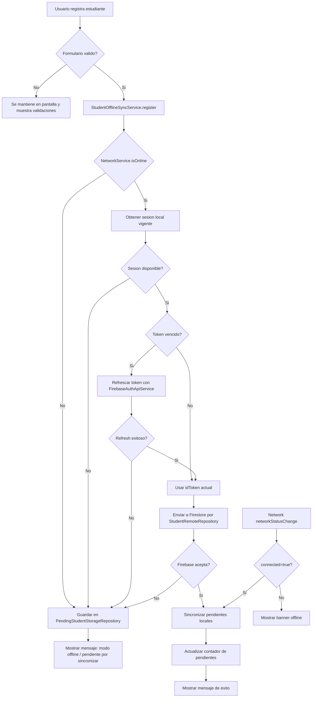
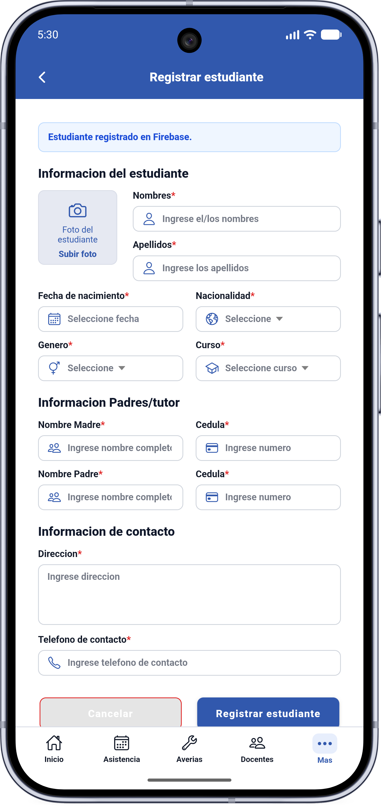
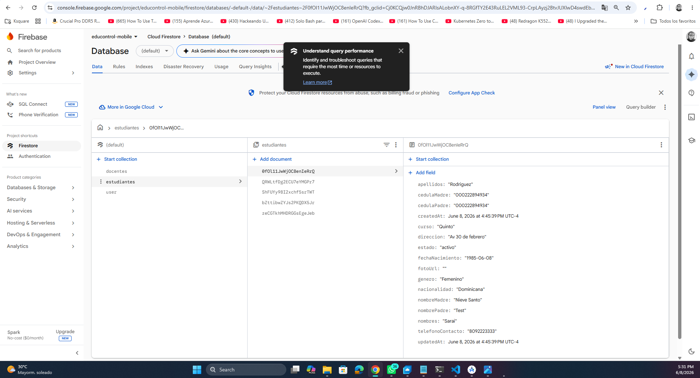
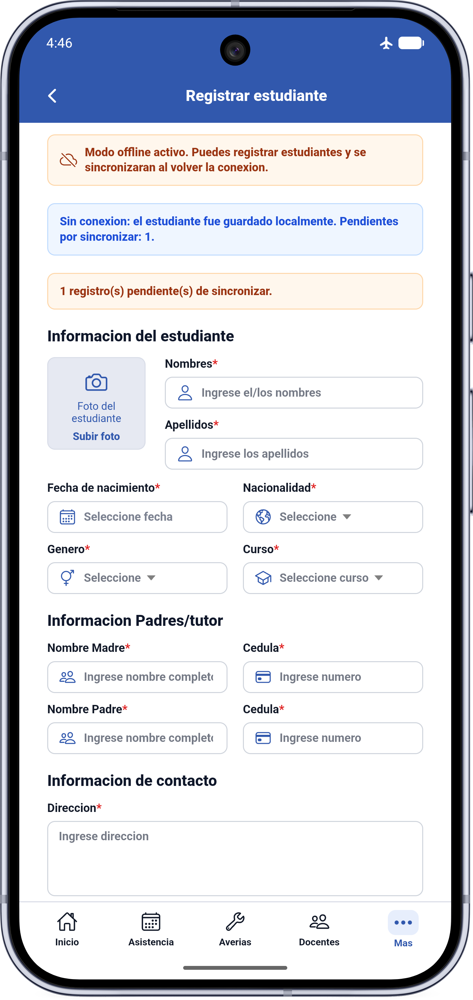
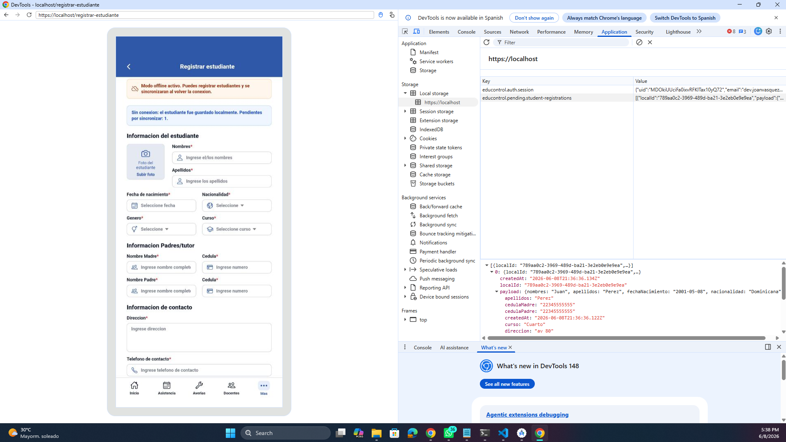

# Entregable 3 - Documentacion tecnica del modulo de conectividad

## Alcance

Este documento describe el modulo de conectividad y modo offline implementado para la pantalla `/registrar-estudiante`.

El modulo permite:

- Detectar cambios de red con `@capacitor/network`.
- Mostrar un aviso visual cuando la aplicacion esta offline.
- Guardar registros de estudiantes localmente cuando no hay conexion.
- Enviar registros directamente a Firebase cuando hay conexion.
- Sincronizar automaticamente registros pendientes al recuperar conexion.

## Diagrama de flujo



## Capturas de pantalla

### Registro con conexion



### Registro sin conexion


<!-- 


 -->


## Arquitectura del modulo

La implementacion esta separada en dos entregables funcionales dentro de `src/app`:

- `detector_red`: deteccion de conectividad y componente visual de estado.
- `modo_offline`: persistencia local, envio remoto y sincronizacion.

### Componentes principales

| Archivo | Responsabilidad |
| --- | --- |
| `src/app/detector_red/network.service.ts` | Envuelve `@capacitor/network`, mantiene el estado de conectividad y expone observables. |
| `src/app/detector_red/network-status.component.*` | Muestra el banner de modo offline cuando no hay conexion. |
| `src/app/modo_offline/student-offline-sync.service.ts` | Orquesta registro online/offline y sincronizacion de pendientes. |
| `src/app/modo_offline/pending-student-storage.repository.ts` | Persiste registros pendientes en `localStorage`. |
| `src/app/modo_offline/student-remote.repository.ts` | Envia registros a la coleccion `estudiantes` de Firestore por REST. |
| `src/app/modo_offline/student-firestore.mapper.ts` | Convierte el modelo del formulario al formato esperado por Firestore REST. |
| `src/app/student-registration/student-registration.page.ts` | Integra el formulario con el servicio offline y muestra mensajes al usuario. |

## Codigo fuente comentado

### Deteccion de conectividad

Archivo: `src/app/detector_red/network.service.ts`

```ts
const Network = registerPlugin<NetworkPlugin>('Network');

@Injectable({ providedIn: 'root' })
export class NetworkService {
  // BehaviorSubject permite guardar el ultimo estado conocido de red.
  private readonly statusSubject = new BehaviorSubject<ConnectionStatus>({
    connected: true,
    connectionType: 'unknown',
  });

  // status$ se usa en componentes que necesitan el objeto completo.
  readonly status$ = this.statusSubject.asObservable();

  // isOnline$ expone solo el booleano conectado/desconectado.
  // distinctUntilChanged evita notificaciones repetidas con el mismo valor.
  readonly isOnline$ = this.status$.pipe(
    map((status) => status.connected),
    distinctUntilChanged(),
  );

  private async initialize(): Promise<void> {
    // Lectura inicial al arrancar el servicio.
    const status = await Network.getStatus();
    this.updateStatus(status);

    // Listener nativo de Capacitor para cambios de red.
    this.listener = await Network.addListener('networkStatusChange', (networkStatus) => {
      // NgZone asegura que Angular detecte el cambio y actualice la UI.
      this.zone.run(() => this.updateStatus(networkStatus));
    });
  }
}
```

### Banner visual offline

Archivo: `src/app/detector_red/network-status.component.html`

```html
@if (status$ | async; as status) {
  @if (!status.connected) {
    <section class="network-status network-status--offline" aria-live="polite">
      <ion-icon name="cloud-offline-outline" aria-hidden="true" />
      <span>
        Modo offline activo. Puedes registrar estudiantes y se sincronizaran al volver la conexion.
      </span>
    </section>
  }
}
```

Puntos relevantes:

- Solo se renderiza cuando `connected` es `false`.
- `aria-live="polite"` permite que lectores de pantalla anuncien el cambio sin interrumpir al usuario.
- El componente queda aislado y puede reutilizarse en otras pantallas.

### Registro online/offline

Archivo: `src/app/modo_offline/student-offline-sync.service.ts`

```ts
register(student: StudentRegistrationDraft): Observable<RegisterStudentResult> {
  // Si no hay red, no se intenta llamar al servidor.
  if (!this.networkService.isOnline) {
    const queue = this.pendingRepository.add(student);
    this.pendingCountSubject.next(queue.length);

    return of({
      mode: 'offline',
      synced: false,
      pendingCount: queue.length,
    });
  }

  // Si hay red, se obtiene una sesion vigente antes del POST a Firebase.
  return this.getValidSession().pipe(
    switchMap((session) => {
      if (!session) {
        // Sin sesion no se pierde el formulario: se guarda para sincronizar.
        return of(this.queueForLater(student, 'auth-missing'));
      }

      return this.remoteRepository.create(student, session.idToken).pipe(
        // Luego del registro online, intenta vaciar pendientes previos.
        switchMap(() => from(this.syncPending())),
        map((pendingCount) => ({
          mode: 'online' as const,
          synced: true,
          pendingCount,
        })),
      );
    }),
    catchError(() => of(this.queueForLater(student, 'remote-error'))),
  );
}
```

### Sincronizacion automatica

Archivo: `src/app/modo_offline/student-offline-sync.service.ts`

```ts
constructor() {
  this.networkService.isOnline$
    .pipe(
      // Cuando la red vuelve, se intenta sincronizar la cola local.
      switchMap((isOnline) => (isOnline ? from(this.syncPending()) : EMPTY)),
      // Un error de sincronizacion no debe romper la subscripcion global.
      catchError(() => EMPTY),
    )
    .subscribe();
}
```

### Persistencia local

Archivo: `src/app/modo_offline/pending-student-storage.repository.ts`

```ts
add(payload: StudentRegistrationDraft): PendingStudentRegistration[] {
  const queue = this.getAll();

  queue.push({
    id: crypto.randomUUID(),
    payload,
    createdAt: new Date().toISOString(),
  });

  localStorage.setItem(this.storageKey, JSON.stringify(queue));
  return queue;
}
```

La cola local usa `localStorage` porque el alcance actual es un entregable simple y no requiere consultas complejas. Si el modulo crece, se puede reemplazar por `@ionic/storage` o IndexedDB manteniendo el mismo contrato de repositorio.

## Decisiones de diseno

- **Separacion por responsabilidad:** la deteccion de red, la persistencia local, el envio remoto y el mapeo a Firestore estan en clases separadas.
- **Patron Repository:** `PendingStudentStorageRepository` y `StudentRemoteRepository` ocultan detalles de almacenamiento y comunicacion HTTP.
- **Patron Service:** `StudentOfflineSyncService` concentra la logica de negocio del modo offline.
- **Principio de responsabilidad unica:** cada archivo tiene una razon clara de cambio.
- **Principio abierto/cerrado:** se puede cambiar `localStorage` por `@ionic/storage` sin tocar la pantalla, siempre que el repositorio conserve sus metodos.
- **Sin perdida de datos:** si Firebase falla por permisos, sesion o error remoto, el registro se mantiene en la cola local.
- **Sincronizacion oportunista:** se sincroniza al recuperar conexion y despues de un registro online exitoso.
- **UI no intrusiva:** el banner offline solo aparece cuando no hay conexion, y los mensajes de guardado explican el estado sin bloquear el formulario.

## Consideraciones de Firebase

El modulo envia documentos a:

```text
projects/educontrol-mobile/databases/(default)/documents/estudiantes
```

Durante la prueba en Android, Firestore respondio `403 PERMISSION_DENIED` cuando las reglas no permitian escribir en `estudiantes`. Para que el envio online funcione, las reglas deben permitir `create` a usuarios autenticados con rol autorizado.

Se agrego un archivo de referencia en la raiz del proyecto:

```text
firestore.rules
```

## Procedimiento de prueba recomendado

1. Abrir la app en Android Studio con un emulador.
2. Iniciar sesion con un usuario activo y rol autorizado.
3. Entrar a `/registrar-estudiante`.
4. Con conexion, registrar un estudiante y verificar que se intente enviar a Firebase.
5. Activar modo avion.
6. Registrar otro estudiante y verificar el mensaje de guardado local.
7. Desactivar modo avion.
8. Verificar que la cola se sincronice automaticamente o tras registrar un nuevo estudiante online.

## Comandos utiles de verificacion

```bash
npm run lint
```

```powershell
adb -s emulator-5554 shell cmd connectivity airplane-mode enable
adb -s emulator-5554 shell cmd connectivity airplane-mode disable
```

```powershell
adb -s emulator-5554 logcat -d --pid=$(adb -s emulator-5554 shell pidof com.educontrol.app)
```
